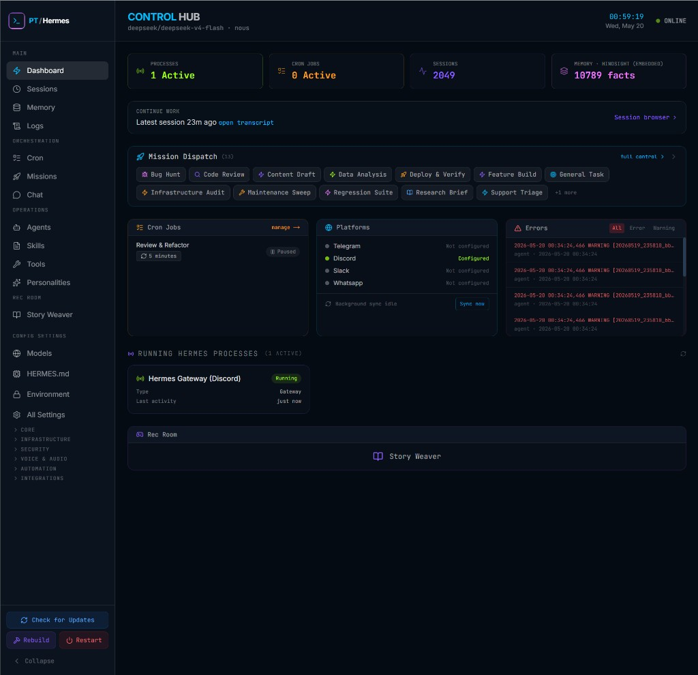
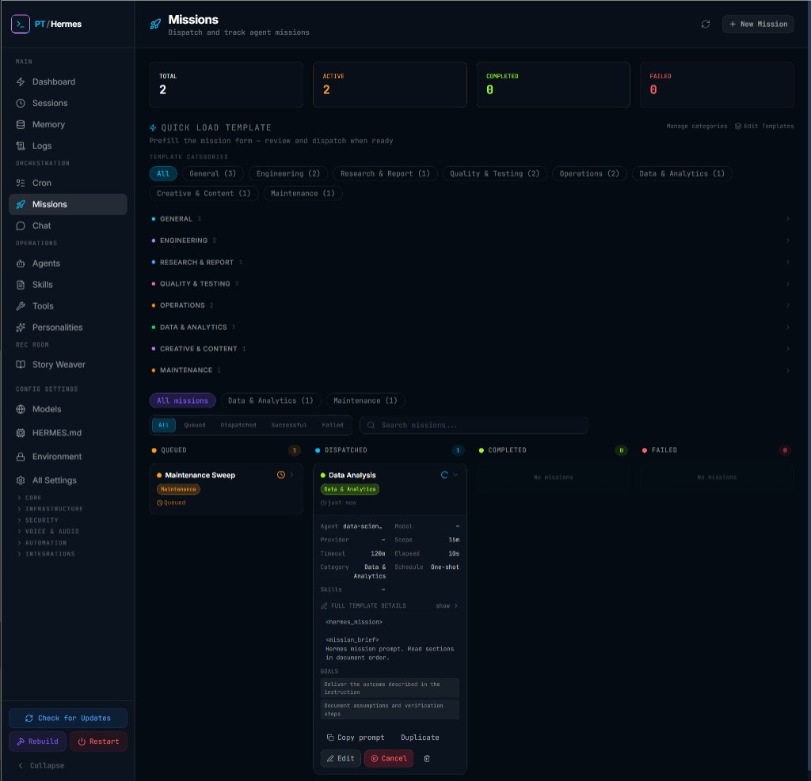
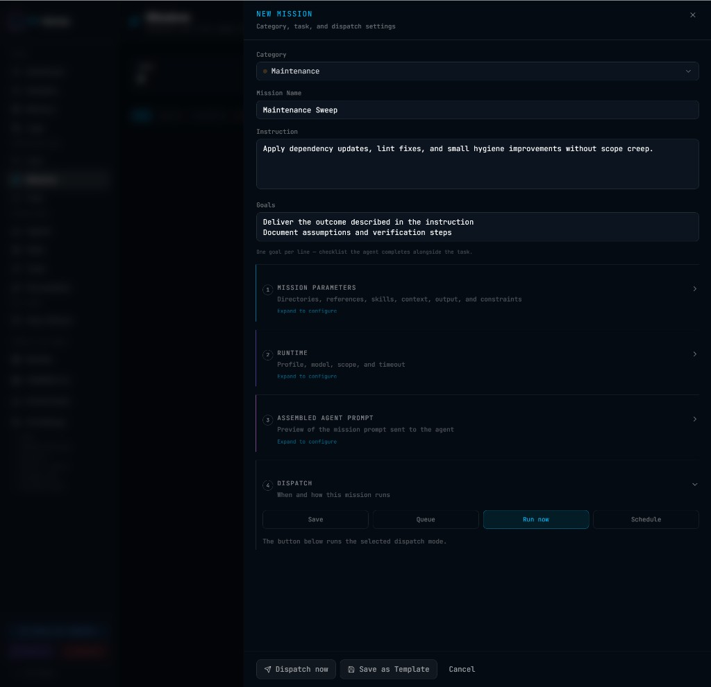
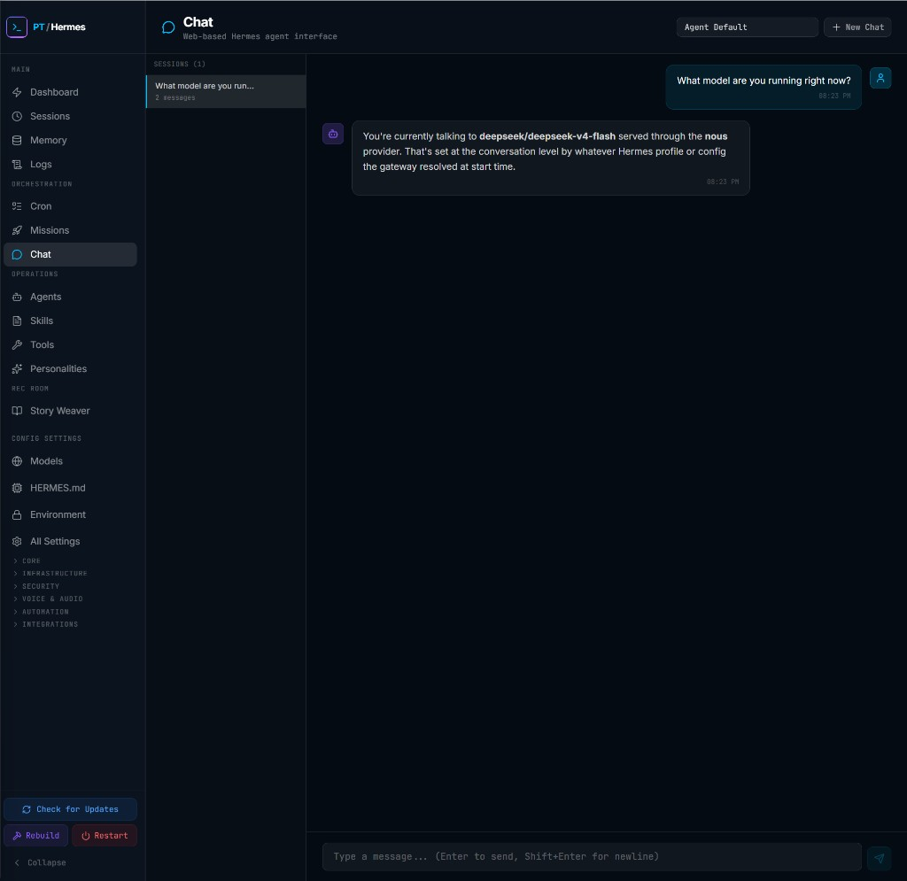
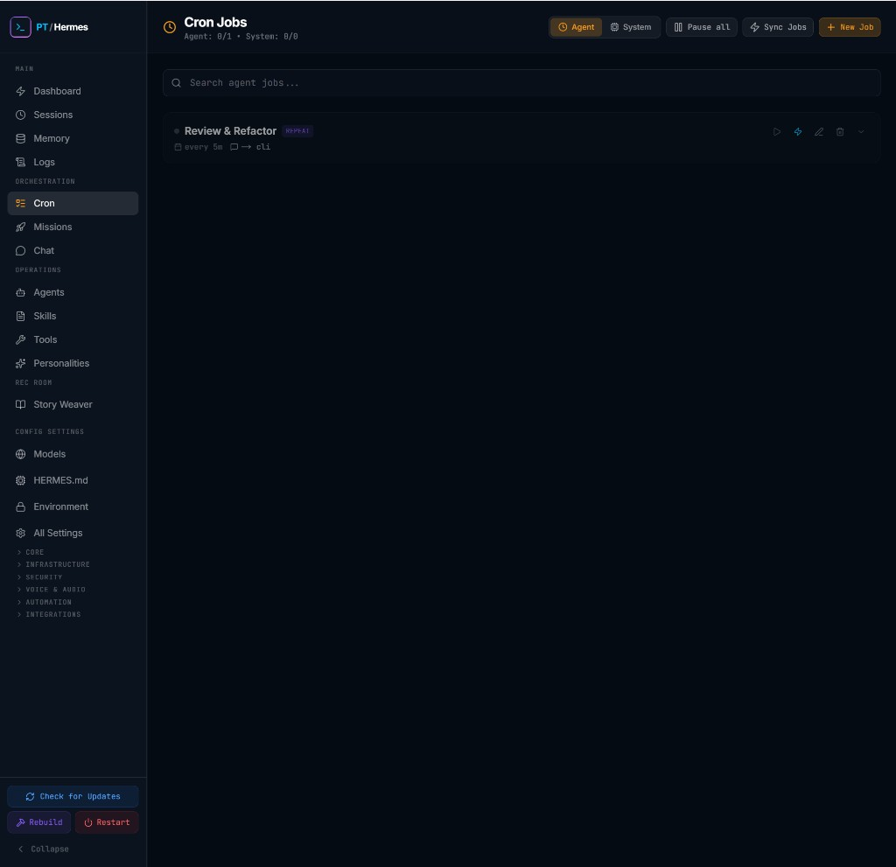
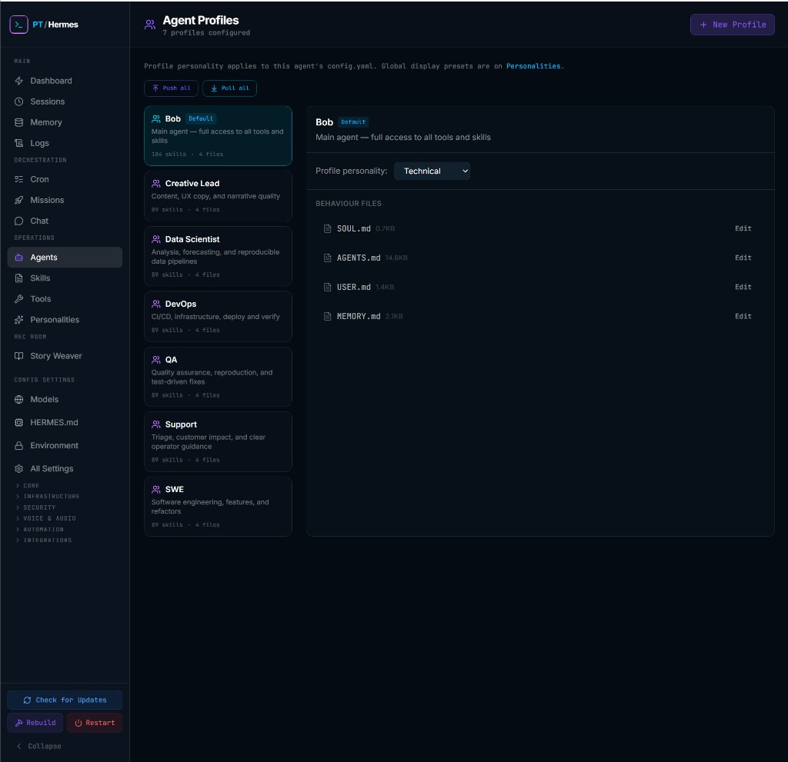
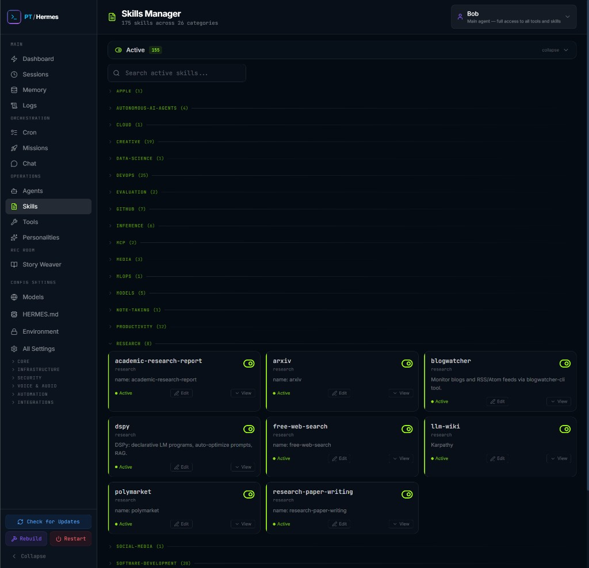
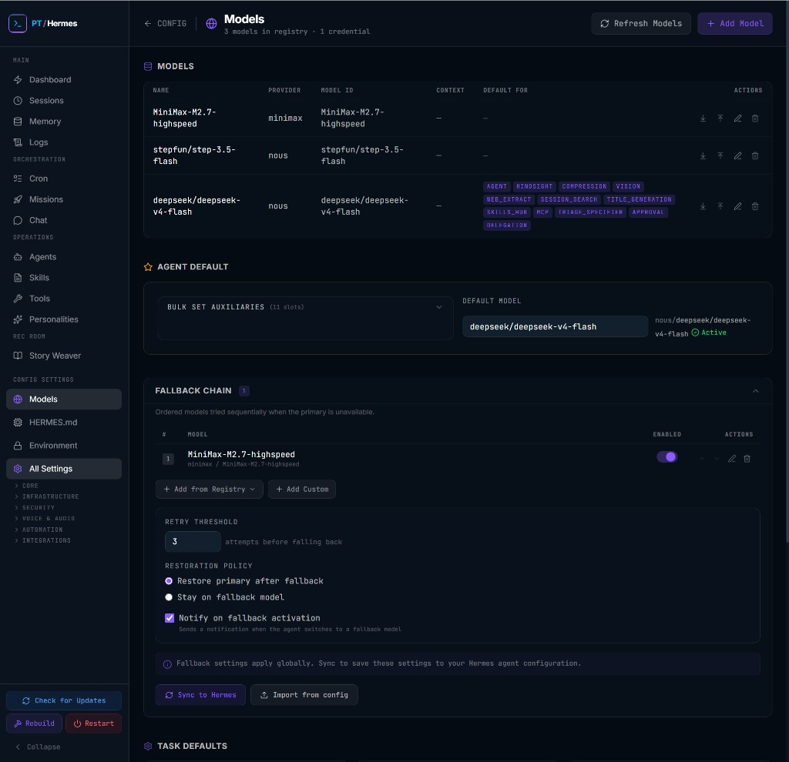

# Control Hub — User walkthrough

This guide describes what each area of Control Hub does and how to use it day to day. It is for **operators** who already installed Hermes and Control Hub (see [README](../README.md)). For API details and deployment, use the [documentation index](README.md). I wrote it so you do not have to read the whole codebase to find the mission board.

---

## What Control Hub is

**Hermes Agent** runs on your machine: it executes tools, delegates sub-tasks to subagents, talks to chat platforms, and stores config under `~/.hermes`.

**Control Hub** is the web dashboard for that install. You use it to see health at a glance, dispatch missions, manage cron, browse sessions, tune models, and edit agent behaviour—without living in the terminal.

The sidebar groups features into:

| Section | Purpose |
|---------|---------|
| **Main** | Overview, sessions, memory, logs |
| **Orchestration** | Cron, missions, gateway chat |
| **Operations** | Agent profiles, skills, tools, personalities |
| **Rec Room** | Story Weaver (interactive fiction) |
| **Config** | Models, HERMES.md, environment, YAML sections |

Use **Check for Updates**, **Rebuild**, and **Restart** at the bottom of the sidebar to maintain the Control Hub app itself (see [DEPLOY.md](DEPLOY.md)).

---

## Dashboard

The dashboard is your **status board**, not the primary place to launch missions.

**What you see**

- Live stats: processes, cron jobs, sessions, memory facts
- **Continue work** — jump to the latest session
- **Mission dispatch** shortcuts — quick links to templates (full composer is on the Missions page)
- **Cron jobs**, **Platforms** (gateway integrations), and **Errors** at a glance
- **Running Hermes processes** — gateways and agents currently active

**Typical use**

1. Open Control Hub after install to confirm **ONLINE** and that Hermes paths resolve.
2. Check **Running Hermes processes** if something looks stuck.
3. Use **Sync now** under Platforms when you have changed Hermes config outside the UI.
4. Follow **Continue work** or open **Sessions** for conversation history.

For mission work, go to **Orchestration → Missions**.

---

## Missions (mission board)

The mission board is where you **compose, dispatch, schedule, and cancel** agent work.

**What you see**

- Summary counts: Total, Active, Completed, Failed
- **Quick load template** — category filters and template list to prefill the composer
- Kanban columns: **Queued**, **Dispatched**, **Completed**, **Failed**
- Expanded cards show agent, scope, timeout, mission brief, and actions (Copy, Duplicate, Edit, **Cancel**)

**Typical use**

1. Click **+ New Mission** (or pick a template below).
2. Fill instruction, goals, and optional runtime (profile, model) in the sheet.
3. Choose dispatch mode: **Save**, **Queue**, **Run now**, or **Schedule**.
4. Watch the card move to **Dispatched**, then **Completed** or **Failed**.
5. To stop a running mission, expand the card and click **Cancel**. The UI updates immediately; the underlying `hermes chat` process is stopped in the background. See [MISSIONS.md](MISSIONS.md#cancellation).

---

## New mission (composer)

The **New Mission** sheet is the full composer.

**Sections**

1. **Category & name** — organises templates and the board
2. **Instruction & goals** — what the agent should do (goals are one per line)
3. **Mission parameters** (optional) — directories, references, skills, context, output format, constraints
4. **Runtime** (optional) — profile, model, scope, timeout
5. **Assembled agent prompt** — preview of the XML payload sent to Hermes
6. **Dispatch** — Save, Queue, **Run now**, or Schedule (cron expression)

**Typical use**

1. Start from a template or blank.
2. Expand **Runtime** if this job should not use the default profile/model.
3. Expand **Assembled agent prompt** to verify the agent-facing text.
4. Click **Dispatch now** for immediate runs, or **Schedule** for recurring work (creates a linked cron job).

**Save as Template** stores your form as a reusable custom template for the board.

---

## Chat

**Orchestration → Chat** is a **web chat** against the Hermes gateway—not the same as dispatching a mission.

**What you see**

- Session list (left)
- Message thread with the selected agent profile
- **+ New Chat** and profile selector (e.g. Agent Default)

**Typical use**

1. Pick a profile that matches the model and tools you need.
2. Ask questions, test models, or debug gateway connectivity.
3. Use **Sessions** under Main for full transcript history and search.

Missions use non-interactive `hermes chat -q` with a structured mission prompt; chat uses the gateway completion path. See [MISSIONS.md](MISSIONS.md) for the difference.

**Model:** Inference uses `model.default` in `~/.hermes/config.yaml`, not only the chat dropdown label. Set **Config → Models → Agent default** and push to Hermes (or run `hermes model`) before chatting; otherwise the gateway may return “Model parameter is required”.

---

## Cron jobs

**Orchestration → Cron** manages **agent cron** jobs (stored in Hermes `jobs.json` and synced by Control Hub).

**What you see**

- **Agent** vs **System** toggle (system cron uses hardware scripts under `CH_DATA_DIR`)
- **Pause all**, **Sync Jobs**, **+ New Job**
- Job rows with schedule (e.g. `every 5m`), target (`cli`), and actions (play, trigger, edit, delete)

**Typical use**

1. Create or edit a job with a schedule and payload.
2. Use **Sync Jobs** after editing Hermes files on disk.
3. Link recurring **missions** from the mission composer (**Schedule** mode)—cancel pauses the linked cron.

Details: [SYSTEM-CRON.md](SYSTEM-CRON.md) for system/hardware cron.

---

## Agent profiles

**Operations → Agents** (Agent Profiles) lists **professional profiles** plus the default **Bob** persona.

**What you see**

- Profile list with skill/file counts
- **Push all** / **Pull all** — sync profile trees between Control Hub SQLite and `HERMES_HOME/profiles/`
- Selected profile: personality preset, **behaviour files** (`SOUL.md`, `AGENTS.md`, `USER.md`, `MEMORY.md`) with **Edit**

**Typical use**

1. Select a profile (e.g. QA, SWE, DevOps) before dispatching a mission in **Runtime**.
2. Edit behaviour files to tune tone and rules for that role.
3. After changing files on disk, use **Pull all**; after editing in the UI, use **Push all**.

Catalog seeding on install: [CATALOG_AND_PROFILES.md](CATALOG_AND_PROFILES.md). Restore defaults: **Config → Seed**.

---

## Skills manager

**Operations → Skills** shows skills available to the active profile, grouped by category.

**What you see**

- Search and **Active** filter
- Collapsible categories (Research, DevOps, Creative, …)
- Per-skill cards with **Active** toggle, **View**, and **Edit**

**Typical use**

1. Select the profile chip (e.g. Bob) to scope which skills you are managing.
2. Enable or disable skills for that agent’s capabilities.
3. Open **View** to read the skill definition on disk.

Skills are defined under the Hermes install; Control Hub reflects and toggles them for the selected profile.

---

## Hermes toolsets (per profile)

**Operations → Tools** edits **`platform_toolsets`** for each agent profile (SQLite source of truth, mirrored to `config.yaml` on save/push).

**What you see**

- **Profile selector** — Bob (default root) or a named profile (QA, Creative Lead, etc.)
- **Platform sections** — CLI, Discord, Telegram, … with Hermes toolset checkboxes
- **Pull / Push** — sync disk (`~/.hermes`) with Control Hub when you edit with `hermes tools` on the host
- **Drift banner** — when disk and SQLite disagree (same semantics as Operations → Agents)

**Typical use**

1. Select the profile that will run your missions.
2. Enable the Hermes toolsets that profile should use per platform.
3. **Save & push toolsets** (or Push) after UI edits; **Pull** after CLI/disk edits.
4. On **Operations → Agents**, use profile push/pull for full behaviour files (SOUL, AGENTS, memories).

See [TOOLS_AND_MISSIONS.md](TOOLS_AND_MISSIONS.md) for how mission “recommended toolsets” relate to runtime tools.

---

## Models configuration

**Config → Models** is the **model registry**: credentials, defaults, and fallback chain.

**What you see**

- Model table (name, provider, model ID, default-for slots)
- **Agent default** and bulk auxiliary defaults
- **Fallback chain** with reorder, retry threshold, sync/import actions

**Typical use**

1. **+ Add Model** and attach API credentials.
2. Set **Agent default** for mission and chat runs.
3. Configure **Fallback chain** for resilience, then **Sync to Hermes** so `config.yaml` matches.
4. Use **Import from config** when Hermes was edited outside Control Hub.

---

## Suggested workflows

### Dispatch and cancel a mission

1. **Orchestration → Missions** → **+ New Mission**.
2. Choose template or write instruction → **Run now**.
3. Card appears under **Dispatched**; expand to watch brief and metadata.
4. To stop early: **Cancel** → confirm. Card moves to **Failed** immediately; agent process stops shortly after.

### Schedule recurring work

1. In the composer, choose **Schedule** and enter a cron-style schedule (e.g. `every 5m`).
2. Dispatch; a linked cron job is created (visible under **Cron**).
3. Cancel from the mission board pauses that cron job.

### Switch agent profile for one job

1. In **New Mission**, expand **Runtime**.
2. Select profile (e.g. QA, Data Scientist).
3. Optionally override model; dispatch.

### Enable a skill for Bob

1. **Operations → Skills** → ensure Bob is selected.
2. Find the skill category → toggle **Active**.
3. Dispatch a mission using profile **default** or **Bob** as configured.

### Set default model

1. **Config → Models** → set **Agent default**.
2. **Sync to Hermes**.
3. Verify in **Orchestration → Chat** or dispatch a short test mission.

---

## Related documentation

| Topic | Document |
|-------|----------|
| Install & quick start | [README.md](../README.md) |
| Mission prompts & cancel | [MISSIONS.md](MISSIONS.md) |
| Profiles & catalog seed | [CATALOG_AND_PROFILES.md](CATALOG_AND_PROFILES.md) |
| REST API | [API.md](API.md) |
| Deploy & updates | [DEPLOY.md](DEPLOY.md) |
| Hermes config checklist | [HERMES_CONFIG_INTEGRATION.md](HERMES_CONFIG_INTEGRATION.md) |
